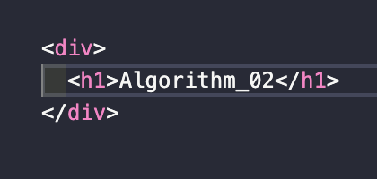

> `서적` : **'자바스크립트로 하는 자료 구조와 알고리즘'**을 읽고 이해한 내용 정리

# Algorithm Study(자바스크립트의 특징) - 02. 😃

자바스크립트로 알고리즘을 공부하기 위해 자바스크립트만의 독특한 특징을 정리한다.

## 01. 자바스크립트의 범위.

범위(`scope`)는 자바스크립트 변수에 대한 접근 권한을 정의하는 것이다.

이에 대한 자바스크립트만의 특징을 확인해 보자.

---

자바스크립트는 연산자가 없이 선언을 할 수 있다.

```js{}
foobar = 'testing'
console.log(foobar) // "testing"
```

🚨 변수 `foobar`의 타입을 선언하지 않아도 사용이 가능하나 해당 방법은 지양하자.

🚨 또한 `var`를 사용하여 선언하는 것을 지양하도록 한다.

이유는 다음과 같다.

```js{1,4}
var foobar = 'first'

function foobarFn() {
  foobar = 'second'
  console.log(foobar)
}

foobar = 'thired'

foobarFn() // "second"
console.log(foobar) // "second"
```

`javascript`에서는 **호이스팅**에 의하여 예상치 못하는 결과가 나타날 수 있다.

그래서 `let`이나 `const`의 사용을 권장한다.

```js{}
let foo = 'first' // 전역 변수

function foobarFn() {
  let foo = 'foo' // 지역 변수
  let bar = 'bar' // 지역 변수
  console.log(foo)
}

foobarFn() // "foo"
console.log(foo) // "first"
console.log(bar) // "ReferenceError: bar is not defined"
```

`let`은 지역 변수로서 값이 변경이 가능하고, `const`는 한번 선언된 값을 변경할 수 없다.

## 02. 등가(Equal)와 형(Type).

변수는 기본형(primitive)과 참조형(reference)으로 구분된다.

기본형은 `boolean, number, string, undefined, null, symbol` 6가지가 있다.

참조형은 기본형을 제외한 나머지 `Object(function, array, map...)` 이다.

여기서 **참/거짓**을 구분하기 위해 `type`을 비교하게 되는데 각 형의 타입은 다음과 같다.

```js{13, 14}
let speak = true
typeof speak // boolean

let count = 4
typeof count // number

let name = 'david'
typeof name // string

let notDefined
typeof notDefined // undefined

let none = null
typeof none // object

let color = ['blue', 'red', 'green']
typeof color // object

let fn1 = function() {
  console.log('This is function')
}
typeof fn1 // function
```

이 중에 조심해야할 것이 있다.

`null`의 경우 타입이 `object`로 되어 있다는 것을 기억하자.

---

참과 거짓을 구분할 때는 다음과 같은 방법으로 접근하면 된다.

**거짓(`falsy`) 조건들**

- false
- 0
- "", ''(빈 문자열)
- NaN
- undefined
- null

위의 `falsy`를 제외한 나머지 값을 `truthy`로 간주하면 된다.

---

\=== VS \== 두 가지의 차이점

- \=== 의 경우 비교시 형변환(type change)을 허용하지 않는다.
- \== 의 경우 비교시에 형변환을 허용한다.

---

Object의 경우 참조형이기 때문에 메모리 주소값이 같이 않는 이상 false를 나타내게 된다.

각 속성의 값을 서로 비교하기 위해서는 별도의 함수를 이용한 대조 작업이 필요하다.

👋
