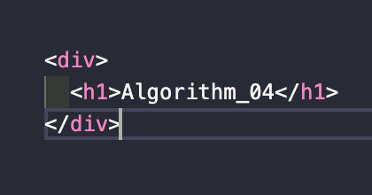

> `서적` : **'자바스크립트로 하는 자료 구조와 알고리즘'**을 읽고 이해한 내용 정리

# Algorithm(자바스크립트 문자열) - 04. 😃

자바스크립트로 문자열과 String 객체 그리고 내장 함수들을 알아보자. 그리고 문자열 인코딩, 디코딩, 임호화, 복호화에 대해서도 알아볼 것이다.

## 01. 자바스크립트 문자열 기본

### 01-01. 문자열 접근

자바스크립트에서 사용하는

## 02. 정규표현식

## 03. 인코딩

## 04. Base64 인코딩

## 05. 문자열 단축

## 06. 암호화

👋
