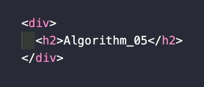

> `서적` : **'자바스크립트로 하는 자료 구조와 알고리즘'**을 읽고 이해한 내용 정리

# Algorithm(자바스크립트 배열) - 05. 😃

자바스크립트로 문자열과 String 객체 그리고 내장 함수들을 알아본다.

## 01. 자바스크립트 배열

배열은 일반적으로 사용되는 자료 구조이다.

```js{}
'cat'.charAt(1) // "a"를 반환한다.
```

### 01-01. 문자열 접근

문자에 접근하는 방법은 `.charAt()`을 이용한다.

## 02. 반복

## 03. 도움 함수

👋
