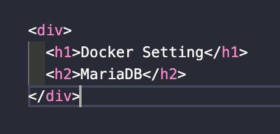

# Docker Setting for MariaDB ☦️

## 01. Docker 컨테이너에서 MariaDB 설정하기(준비물)

- MacOS 기준 / Docker 설치

## 02. Maria 이미지 다운로드 & 설정.

터미널에 접속하여 Docker에 MariaDB image 다운로드 하기.

```sh
# Docker - MariaDB image Download
# --------------------------------
$ docker pull mariadb
```

Maria 이미지 다운로드가 완료되면 MariaDB 컨테이너를 만들어 보자.

> `예시 설정` : 포트번호 - 3306 / 접속 비밀번호 - mariadb

```sh
# Docker - MariaDB Container Create
# ----------------------------------------
$ docker run --name mariadb
-d -p 3306:3306
-v /Users/Shared/data/mariadb:/var/lib/mysql
--restart=always
-e MYSQL_ROOT_PASSWORD=mariadb mariadb
```

> `설정 설명`  
> **–-name** : 컨테이너 이름  
> **-d** : 데몬으로 실행  
> **-p** : {도커 컨테이너 외부}:{도커 컨테이너 내부} port(포트)  
> **-v** : {도커 컨테이너 외부}:{도커 컨테이너 내부} volume(저장소)  
> **--restart** : 도커 서버 구동시 재시작 여부

✅ 이후 컨테이너가 정상적으로 올라갔는지 체크.

```sh
# Docker - MariaDB Container Check
# ---------------------------------
$ docker ps -a

# Expect Result
# --------------------------------------------------------------------------------------------------
# CONTAINER ID  |  IMAGE   |  COMMAND    |  CREATED      |  STATUS      |  PORTS          | NAMES
# 263242sam915  |  mariadb |  "docker…"  |  3 weeks ago  |  Up 2 hours  |  3306->3306/tcp | mariadb
```

## 03. 도커 컨테이너 설정하기.

MariaDB 컨테이너 상태 확인 후 종료되어 있다면 작동시키기.

```sh
# Docker - MariaDB Container Check & Start
# -----------------------------------------
$ docker ps -a

# Docker - If MariaDB Container exited...
# -----------------------------------------
$ docker start mariadb
```

이후에 mariadb 컨테이너의 `bash`로 접속한다.

```sh
# Docker - Access to MariaDB Container(bash)
# -------------------------------------------
$ docker exec -it mariadb /bin/bash
```

## 04. bash에서 MariaDB 설정하기.

`bash`에서 mariadb 설정해보자.

```sh
# Bash - Access to MariaDB Setting
# -------------------------------------
>>> vi /etc/mysql/my.cnf
```

파일로 접속한 후에 설정 값을 업데이트 하자.

> **🚨 주의**
>
> - vi 에디터를 사용해야 하는데 인식이 되지 않는 경우에는 다음과 같이 할 것.
>
> ```sh
> # Bash - Install vi Editor
> # -------------------------------------
> >>> apt-get update
> >>> apt-get install nano
> >>> apt-get install vim
>
> ```

파일에서 업데이트할 내용은 다음과 같다.

```sh
[client]
default-character-set = utf8mb4

[mysql]
default-character-set = utf8mb4

[mysqld]
collation-server = utf8mb4_unicode_ci
init-connect='SET NAMES utf8mb4'
character-set-client-handshake = FALSE
character-set-server = utf8mb4

```

업데이트가 완료되면 다시 터미널로 돌아가서 컨테이너를 재시작하자.

```sh
# Docker - MariaDB Container restart
# -----------------------------------
$ docker restart mariadb
```

## 05. MariaDB 설정 확인하기.

`bash`에서 mariadb로 접속
컨테이너 설정 때 입력한 **비밀번호**로 접속하자.

```sh
# Bash - Access to MariaDB(inside)
# -------------------------------------
>>> mariadb -u root -p
>>> Enter password: ******* #(mariadb)
```

MariaDB에 접속해서 유니코드를 확인하기.

```sh
# MariaDB
# -----------------------
MariaDB[(none)] > status
```

유니코드가 `utf8mb4`로 설정 되었는지 확인한다.

👋 이제 MariaDB를 사용하면 된다.
