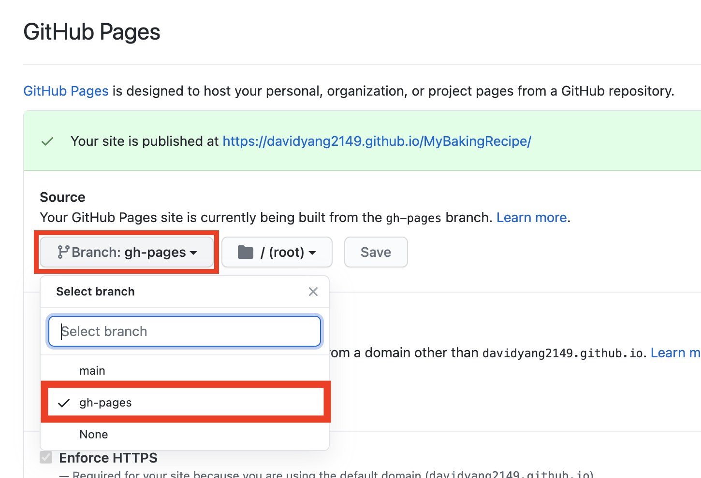
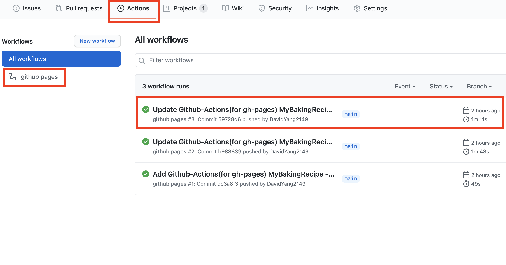

> Github Actions를 이용하여 gh-pages 자동 배포하기

## Github Actions를 이용하여 gh-pages 자동 배포하기 🏆

npm의 [gh-pages](https://www.npmjs.com/package/gh-pages)를 이용하면 Github 저장소에 올린 프로젝트를 무료로 호스팅할 수 있다.
그리고 Github Actions를 이용하여 프로젝트가 변경될 때마다 자동으로 ph-pages를 배포할 수 있도록 설정해보자.

### 1. gh-pages 세팅하기 📚

우선 npm으로 gh-pages를 설치하자.

```sh{}
$ npm install -D gh-pages
```

그리고 package.json에서 다음 예시처럼 설정해준다.

```json
"scripts": {
    "build": "webpack --mode production",
    "predeploy": "npm run build",
    "deploy": "gh-pages -d dist"
  },
```

`build` : 웹팩을 이용하여 결과물을 만든다.

`predeploy` : **pre**가 붙으면 **내용**을 실행하기 전에(여기서는 **deploy**) 먼저 실행한다. `npm run deploy`를 입력하면 먼저 **predeploy**가 실행되어 결과물을 만든다.

`deploy` : `gh-pages -d dist`를 실행하여 github pages에 웹페이지를 배포한다. 이때 **-d {경로}**의 **경로**는 실제 배포되는 위치로 설정한다(dist, public 등).

이렇게 작업을 완료하고 Github 저장소로 Push하자.
그리고 해당 저장소의 Settings로 가서 하단을 살펴보면 Github Pages가 있다.



여기서 Source의 Branch를 ph-pages로 설정해준다.
이제 `https://(GitHub ID).github.io/(Repository name)`에서 배포된 내용을 확인할 수 있다.

### 2. 제일 중요한 Github Actions 추가하기 🔐

그런데 프로젝트의 내용이 업데이트되면 수동으로 `npm run deploy`를 통해 gh-pages를 업데이트하여 Push를 해야 한다.

자동으로 처리할 방법은 없을까?

Github에서 CI/CD 역할을 하는 Actions를 이용하면 된다. **Github Actions**을 이용하면 수정된 내용을 Commit하여 Push할 때마다 자동으로 gh-pages를 업데이트할 수 있다.

우선 `.github/workflow` 폴더를 만들자. 그리고 그 안에 `ph-pages.yml` 파일을 만들고 다음과 같이 내용을 적는다.

```yml{34}
name: github pages

on:
  push:
    branches:
      - main

jobs:
  deploy:
    runs-on: ubuntu-18.04
    steps:
      - uses: actions/checkout@v2

      - name: Setup Node
        uses: actions/setup-node@v2.1.2
        with:
          node-version: '12.x'

      - name: Cache dependencies
        uses: actions/cache@v2
        with:
          path: ~/.npm
          key: ${{ runner.os }}-node-${{ hashFiles('**/package-lock.json') }}
          restore-keys: |
            ${{ runner.os }}-node-

      - run: npm ci
      - run: npm run build

      - name: Deploy
        uses: peaceiris/actions-gh-pages@v3
        with:
          github_token: ${{ secrets.GITHUB_TOKEN }}
          publish_dir: ./dist
```

여기서 마지막 줄의 `publish_dir`의 값을 _build_ 값의 _output_ 경로에 맞추면 된다(dist, public 등).
설정이 끝나면 내용을 정리하여 push하자.



그럼 자동으로 github pages가 업데이트 되는 것을 확인할 수 있다.

좀 더 상세한 내용은 [Github Actions](https://github.com/marketplace/actions/github-pages-action)을 참조하자.

👋
