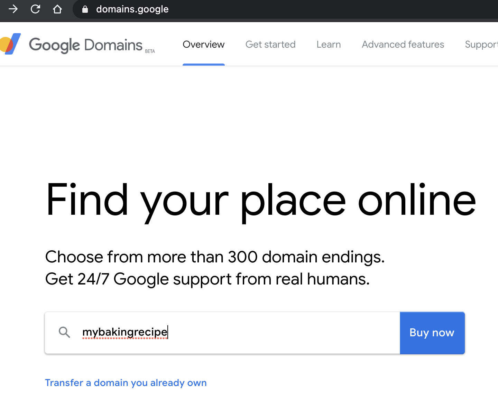
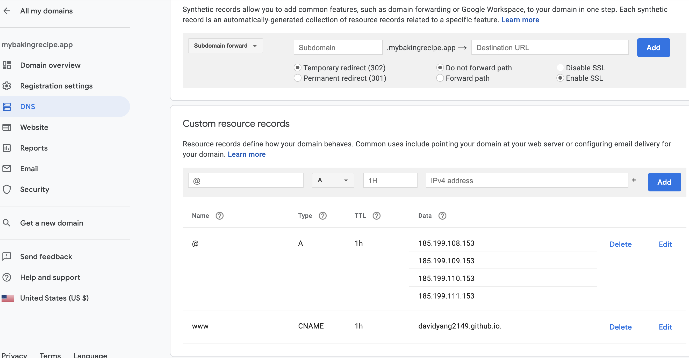
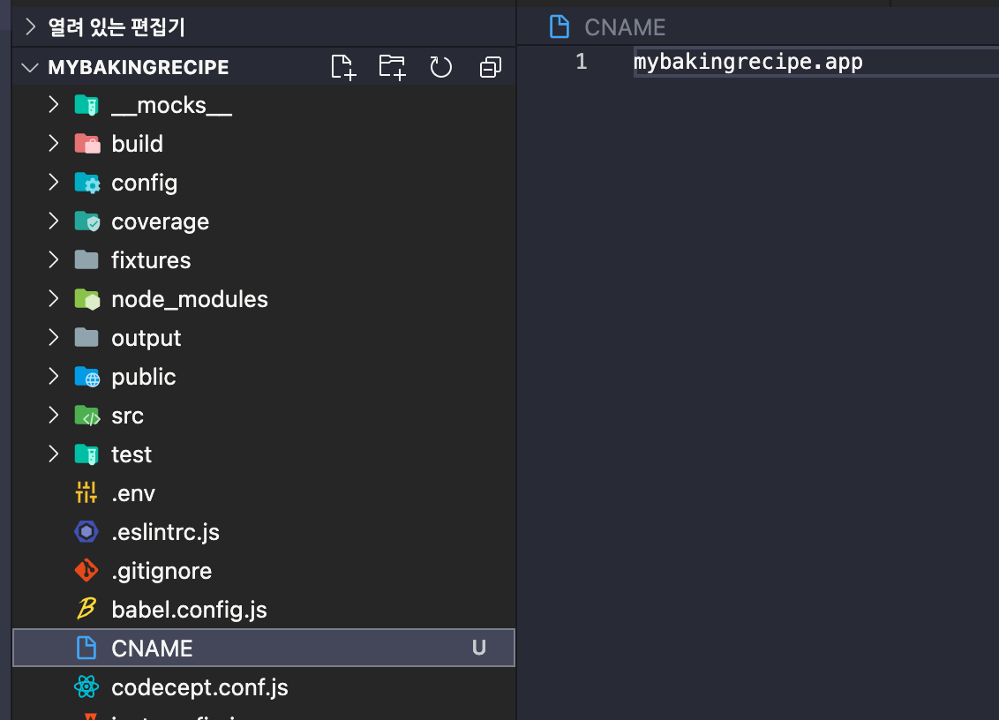
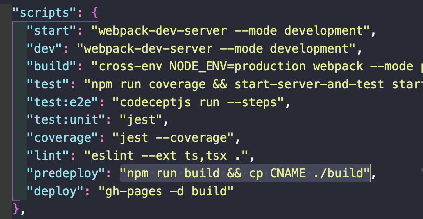

> Github Pages에 Custom domain 적용하기

## Github Pages에 Custom domain 적용하기 🏆

[gh-pages](https://www.npmjs.com/package/gh-pages)를 이용하면 무료로 웹페이지를 구축할 수 있다.

여기에 커스텀 도메인을 구입하여 github pages에 적용해보자.

### 1. Google domain으로 도메인 구입하기 📚

[google domain](https://domains.google)으로 들어가서 원하는 도메인명을 검색한다.



원하는 도메인을 구입한 뒤 도메인의 설정으로 들어가자.

여기서 DNS로 들어가서 레코드를 추가해준다.

```sh
185.199.108.153
185.199.109.153
185.199.110.153
185.199.111.153
```

그리고 자신의 github pages 주소도 추가해준다.

```sh
davidyang2149.github.io
```



여기까지 작업이 되면 Github의 리포지토리로 돌아가서 **Setting > Custom Domain**에 해당 주소를 추가해주면 된다.

### 2. Github Pages Deploy 문제 해결하기 🔐

그런데 `npm run deploy`로 수정된 내용을 배포할 때마다 **Custom domain**이 초기화 되는 문제가 발생했다.

이를 해결하기 위해서 `CNAME` 파일을 추가한 뒤 **Custom domain**의 주소를 적어준다.

> CNAME?
>
> Canonical Name record의 준말로 하나의 도메인 이름을 다른 이름으로 매핑시키는 도메인 네임 시스템(DNS)의 리소스 레코드의 일종이다.
>
> [참조](https://ko.wikipedia.org/wiki/CNAME_%EB%A0%88%EC%BD%94%EB%93%9C)



그리고 **package.json**으로 들어가서 `predeploy`에 **cp CNAME ./build**을 추가해준다.



이제 배포를 진행해도 커스텀 도메인이 그대로 유지된다.

👋
