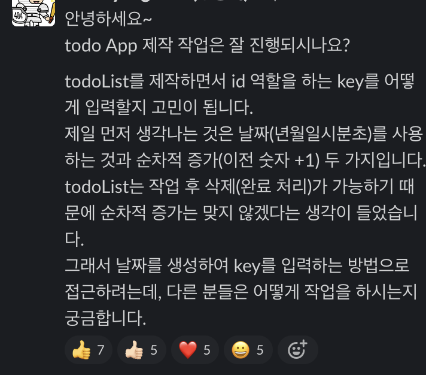

> UUID 언제 사용해야 할까?

## UUID, 언제 사용해야 할까 🏆

### 1. 발단 📋

코드숨에서 To-do App 과제를 진행하던 중 ordered list에 [key값](https://reactjs.org/docs/lists-and-keys.html#keys)을 입력해야 하는 상황이 생겼다.
key값을 설정하기 위해 어떤 값을 만들어야할지 고민이 되어 슬랙방에 도움을 요청했다.



많은 분께서 좋은 방법을 알려주셨는데 그 중 하나가 UUID를 사용하는 방법이었다.
UUID는 한 번도 사용해본 적이 없어 관심이 생겨 적용해보았다.

### 2. UUID를 사용해보자 📚

npm에서 [UUID 라이브러리](https://www.npmjs.com/package/uuid)가 존재하여 사용했다.
방법은 간단하다.

```sh{}
$ npm install uuid
```

uuid 라이브러리 설치 후 필요한 곳에 uuid를 import하면 된다.

```js{}
import { v4 as uuidv4 } from 'uuid';

uuidv4(); // ⇨ '9b1deb4d-3b7d-4bad-9bdd-2b0d7b3dcb6d'
```

이렇게 적용하니 고윳값이 생성되어 문제없이 key값에 잘 적용되었다.
그런데 슬랙에서 UUID까지 사용할 필요가 있는지에 대한 의문을 제기해주셨다.


그러고 보니... UUID가 정확히 무엇이고 왜 써야 할지, 또 언제 사용해야 하는지 이유를 생각해보지 않았다.

### 3. UUID가 뭐죠 ❓

[위키백과에서 찾아본 UUID](https://ko.wikipedia.org/wiki/%EB%B2%94%EC%9A%A9_%EA%B3%A0%EC%9C%A0_%EC%8B%9D%EB%B3%84%EC%9E%90)는 **범용 고유 식별자**로서 네트워크상에서 서로 모르는 개체들을 식별하고 구별하기 위해 만들어진 방법이다.

만들어지는 규칙은 **36개 문자**(32개 문자, 4개의 하이픈)로 된 8-4-4-4-12라는 5개의 그룹을 하이픈으로 구분한다고 명시되어 있다. 이렇게 말이다.

> 9b1deb4d-3b7d-4bad-9bdd-2b0d7b3dcb6d

그래서 생성할 수 있는 값은 340,282,366,920,938,463,463,374,607,431,768,211,456개가 된다고 한다.


UUID 표준에 따라 이름을 부여하면 고유성을 완벽하게 보장할 수는 없지만 실제 사용상에서 중복될 가능성이 거의 없다고 인정된다고 한다.

그리고 UUID는 버전에 따라 생성되는 규칙이 다르다고 한다.

- 버전 1 (시간 + MAC 주소)
- 버전 2 (시간 + DCE 보안)
- 버전 3 (시간 + MD5 해시)
- 버전 4 (시간 + 랜덤)
- 버전 5 (시간 + SHA-1 해시)

uuid 라이브러리에서도 각 버전에 맞추어 키를 생성할 수 있다.

그럼 이렇게 좋은 uuid를 언제 써야 할까?

### 4. UUID, 언제 사용해야 할까 🔐

uuid를 언제 써야 할지를 알기 위해 장점을 조사해봤다.


**UUID의 장점**

- 거의 세계적인 고유키를 만들 수 있다

  UUID가 생성할 수 있는 340,282,366,920,938,463,463,374,607,431,768,211,456개의 키는 쉽게 중복될 수 있는 수가 아니다.

- stateless. 즉석에서 생성할 수 있다

  데이터베이스나 여러 언어에서 UUID를 생성할 수 있는 기능을 제공한다.
  그리고 표준에 따라서 UUID를 생성하기 때문에 어디서 누가 생성을 하던 고유성을 충족할 수 있다.

- 쉽게 추적할 수 없다

  키가 생성되는 규칙은 존재하지만 키값의 의미나 연속성을 유추하기가 어렵다.

반대로 단점을 찾아보자면...

**UUID의 단점**

- 연속성이 없다

  UUID는 연속성을 가지기 어렵다. 이 뜻은 UUID를 PK로 하거나 인덱스로 사용하는 데 단점이 된다.
  UUID을 풀어내서 연속성을 찾는 방법도 있고, 데이터베이스에 저장 시 성능 저하를 일으키지 않게 하는 방법도 있었다.
  그렇지만 그 작업도 시간과 자원을 더 소비해야 한다.

- 의미를 읽을 수 없다

  생성된 키값의 의미를 읽을 수 없다는 것은 보안에는 장점이지만 단점이 될 수도 있다.
  키를 활용하기 위해서는 결국 연결점과 의미를 알아야 하는데 그러기 위해서는 추가 데이터가 필요하기 때문이다.

여기까지 조사를 마치고 UUID가 필요하다고 생각되는 두 가지 케이스를 찾았다.

1. 보호하려는 데이터가 있을 경우

   웹서비스에서 개인정보보호 목적으로 사용자의 아이디를 숨기는 경우가 있다.
   그래서 별명을 사용하거나 '아이디 + \*' 값을 표기한다.
   그런데 URL 검색 시 쿼리값에 사용자의 id가 그대로 노출되는 경우가 있다.
   이럴 때 UUID를 활용하여 숨기면 id의 노출을 막을 수 있을 것이다.

2. 식별자로 사용할 경우

   예전에 게임 CD를 사면 안에 고유키값이 있었는데 해당 키를 입력해야 온/오프라인 게임을 즐길 수 있었다.
   마찬가지로 웹서비스에서 이벤트를 진행할 때 당첨쿠폰의 코드값에 UUID를 사용하면 아무나 무작위로 키를 입력하여 당첨되기 어려울 것이다.

나중에 위 케이스가 발생한다면 한번 적용해보자.

👋
