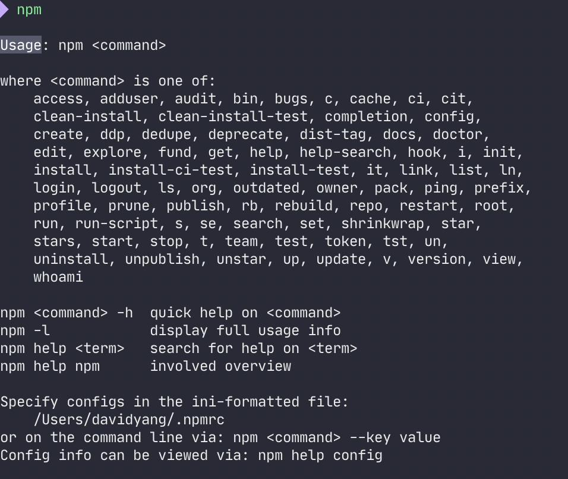
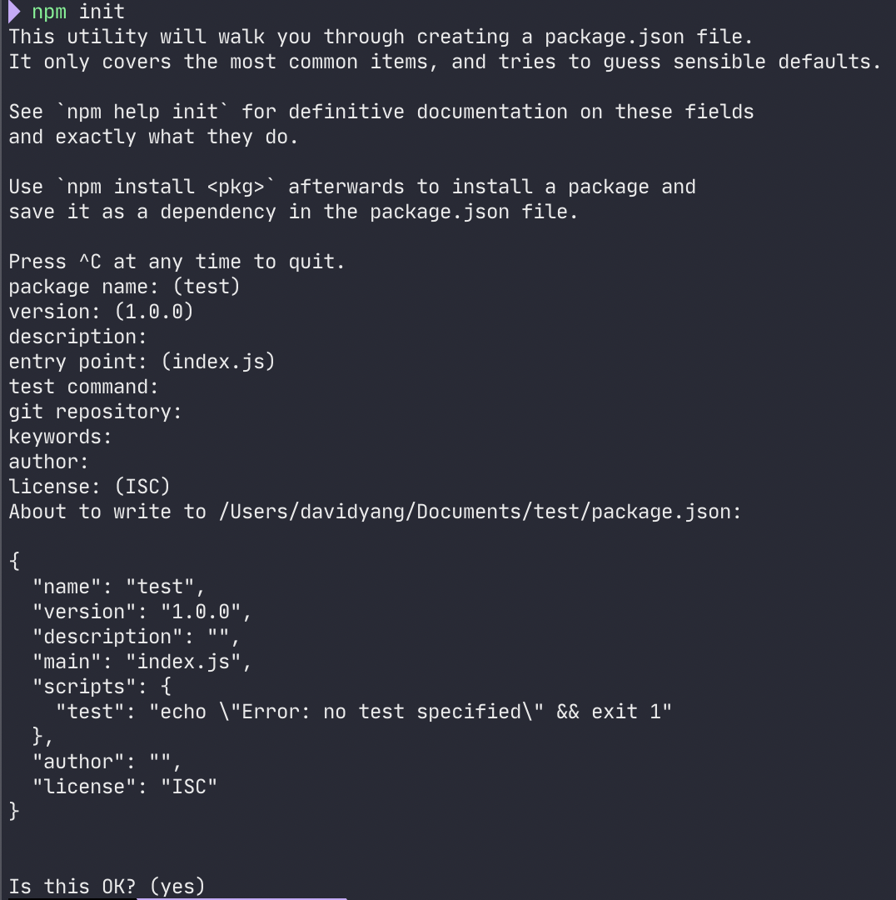

프론트엔드 개발환경 - NPM

> `정보` : [**김정환**](https://jeonghwan-kim.github.io/series/2019/12/09/frontend-dev-env-npm.html#4-%ED%94%84%EB%A1%9C%EC%A0%9D%ED%8A%B8-%EB%AA%85%EB%A0%B9%EC%96%B4)님의 [프론트엔드 개발환경의 이해와 실습](https://www.inflearn.com/course/%ED%94%84%EB%A1%A0%ED%8A%B8%EC%97%94%EB%93%9C-%EA%B0%9C%EB%B0%9C%ED%99%98%EA%B2%BD)을 공부하고 정리한 내용.  
> 해당 내용은 [**김정환**](https://jeonghwan-kim.github.io/series/2019/12/09/frontend-dev-env-npm.html#4-%ED%94%84%EB%A1%9C%EC%A0%9D%ED%8A%B8-%EB%AA%85%EB%A0%B9%EC%96%B4)님의 블로그 내용을 토대로 재작성되었으며 내용을 추가하거나 일부 변경했습니다.

# NPM ❓

**N**ode **P**ackage **M**anager로 Node.js를 설치할 때 함께 설치된다.

> **설치 경로 (Mac 기준)**  
> Node.js : `/usr/local/bin/node`  
> NPM : `/usr/local/bin/npm`

npm의 명령어는 터미널에서 `npm`을 입력하면 확인할 수 있다.



자주 사용하는 명령어는 `init`, `install`, `run`, `uninstall`, `version`이 있다.

# 프로젝트 초기화 🚀

프로젝트를 시작해보자.

## init

터미널에서 작업할 폴더로 이동 후 `npm init`을 입력해보자.



프로젝트의 이름과 버전 등의 정보를 입력할 수 있으며 입력을 마치면 `package.json` 파일이 생성된다.

모두 기본값으로 사용한다면 `npm init -y`로 입력하면 된다.

## package.json

`package.json`의 설정에 관해 확인해보자.

- name : 프로젝트 이름.
- version : 프로젝트 버전 정보.
- description : 프로젝트 설명.
- main : 진입 경로. 프론트엔드 프로젝트일 경우 사용하지 않음.
- scripts : 프로젝트 명령어를 등록.
- author : 프로그램 작성자.
- license : 라이센스.

# 프로젝트 명령어 🍭

`package.json`에서 **"scripts"**를 보면 다음과 같이 되어 있다.

```json
"scripts": {
    "test": "echo \"Error: no test specified\" && exit 1"
  },
```

터미널에서 `npm test`를 입력하면 다음과 같은 결과를 얻는다.

```sh
$ npm test

> echo "Error: no test specified" && exit 1

Error: no test specified
npm ERR! Test failed.  See above for more details.
```

이렇게 `scripts`에 원하는 명령어와 실행 내용을 추가할 수 있다.

> 🚨 주의  
> npm에 등록되지 않은 명령어를 추가했을 때는 \$ *npm run 명령어*로 실행해야 한다.

```json{3,4}
"scripts": {
    "test": "echo \"Error: no test specified\" && exit 1",
    // 예시 : build 추가
    "build": "echo \"build 명령어 추가\""
  },
```

```sh
# run을 붙이지 않아도 정상적으로 작동한다.
$ npm test

> echo "Error: no test specified" && exit 1

Error: no test specified
npm ERR! Test failed.  See above for more details.

# run을 붙이지 않으면 작동하지 않는다.
$ npm build

npm WARN build `npm build` called with no arguments.

# run을 붙이면 정상적으로 작동한다.
$ npm run build

> echo "build 명령어 추가"

build 명령어 추가
```

# 패키지 설치 📦

프로젝트 작업을 하면서 패키지를 설치하는 방법에 관해 알아보자.

## npm install

`npm install`을 이용하면 쉽게 라이브러리와 외부 패키지를 설치할 수 있다.

```sh
$ npm install react
npm notice created a lockfile as package-lock.json. You should commit this file.
npm WARN test@1.0.0 No description
npm WARN test@1.0.0 No repository field.

+ react@16.13.1
added 6 packages from 3 contributors and audited 6 packages in 0.583s
found 0 vulnerabilities
```

여기서는 최신 버전의 `react`를 다운받았다.

[NPM 공식 홈페이지](https://www.npmjs.com)에서 여러 패키지를 검색하고 다운로드할 수 있다.

그리고 다시 `package.json`를 확인해보자.

```json{}
"dependencies": {
  "react": "^16.13.1"
}
```

"dependencies"에 react가 16.13.1 버전으로 설치된 것을 확인할 수 있다.

> 🏆 추가  
> npm install 뒤에 -D를 붙이면 개발 모드로 패키지를 설치할 수 있다.

```sh
$ npm install -D nodemon

> nodemon@2.0.4 postinstall /Users/davidyang/Documents/test/test2/node_modules/nodemon
> node bin/postinstall || exit 0

npm WARN test2@1.0.0 No description
npm WARN test2@1.0.0 No repository field.

+ nodemon@2.0.4
added 121 packages from 58 contributors and audited 127 packages in 3.265s

10 packages are looking for funding
  run `npm fund` for details

found 0 vulnerabilities
```

그리고 `package.json`를 확인해보자.

```json{}
"dependencies": {
  "react": "^16.13.1"
}
"devDependencies": {
  "nodemon": "^2.0.4"
}
```

"devDependencies"로 패키지가 추가된 것을 확인할 수 있다.

이렇게 하면 개발할 때만 해당 패키지를 사용하고 프로덕션에서는 패키지를 설치하지 않는다.

## 패키지 버전

`package.json`에서 각 패키지를 보면 버전에 대한 정보가 있다.

버전 정보 : (메이저 버전).(마이너 버전).(패치 버전)

- 주 버전(Major Version): 기존 버전과 호환되지 않게 변경한 경우
- 부 버전(Minor version): 기존 버전과 호환되면서 기능이 추가된 경우
- 수 버전(Patch version): 기존 버전과 호환되면서 버그를 수정한 경우

```json{}
"dependencies": {
  "react": "~16.13.1"
}
"devDependencies": {
  "nodemon": "^2.0.4"
}
```

틸드(~)와 캐럿(^)은 다음과 같은 뜻을 의미한다.

**틸트(~)** : 마이너 버전이 명시되어 있으면 패치 버전만 변경한다. 예를 들어 ~16.13.1 표기는 16.13.1 부터 16.14.0 미만까지를 포함한다. 마이너 버전이 없으면 마이너 버전을 갱신한다. ~0 표기는 0.0.0부터 1.0.0 미만까지를 포함한다.

**캐럿(^)** : 정식 버전에서 마이너와 패치 버전을 변경한다. 예를 들어 ^2.0.4 표기는 2.0.4부터 2.1.0 미만까지를 포함한다. 정식 버전 미만인 0.x 버전은 패치만 갱신한다. ^0 표기는 0.0.0부터 0.1.0 미만까지를 포함한다.

> 🏆 추가  
> 기존 package.json의 각 패키지를 모두 최신 버전으로 업데이트하는 방법이 있다.

```sh{}
# ncu를 우선 설치한다.
$ npm install -g npm-check-updates

# ncu를 실행하면 업데이트할 수 있는 패키지가 무엇인지 알려준다.
$ ncu

# ncu -u를 실행하면 package.json 버전을 업데이트해 준다.
$ ncu -u

# 이제 npm install을 하여 실제 node_modules를 업데이트해 주자.
$ npm install

```

# 참조 📋

- [김정환님 블로그](https://jeonghwan-kim.github.io/series/2019/12/09/frontend-dev-env-npm.html#4-%ED%94%84%EB%A1%9C%EC%A0%9D%ED%8A%B8-%EB%AA%85%EB%A0%B9%EC%96%B4)
- [인프런 - 프론트엔드 개발환경의 이해와 실습](https://www.inflearn.com/course/%ED%94%84%EB%A1%A0%ED%8A%B8%EC%97%94%EB%93%9C-%EA%B0%9C%EB%B0%9C%ED%99%98%EA%B2%BD)

👋
