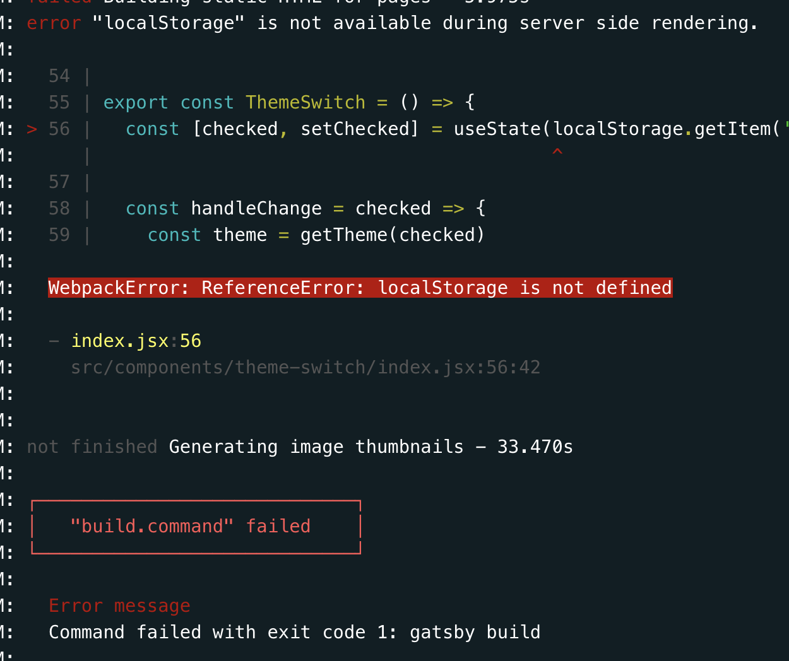
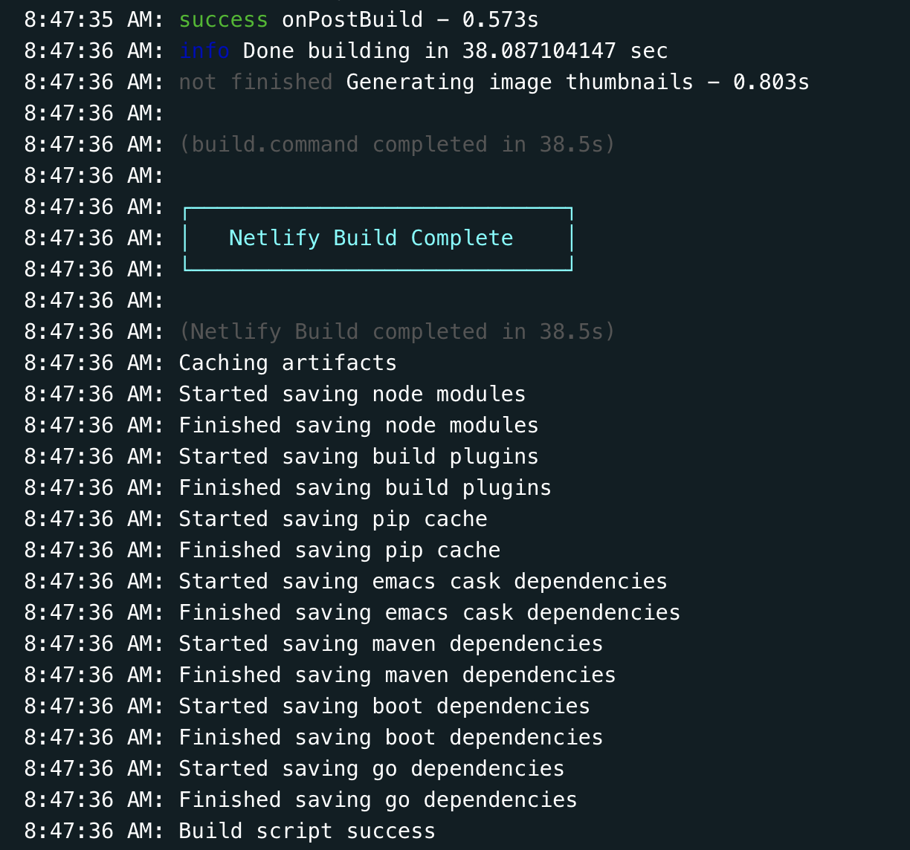

개츠비 커스터마이징 하기 - 다크 모드 저장하기

> `정보` : [**jbee**](https://jbee.io)님의 [Gatsby Theme](https://github.com/JaeYeopHan/gatsby-starter-bee)를 이용하여 직접 커스터마이징을 해보자.

# Dark Mode ❓

jbee님의 Gatsby 테마에는 다크 모드가 기본적으로 내장되어 있다.

하지만 다크 모드로 변경 후 다시 접속하게 되면 모드가 초기화된다.

사용자가 선택한 모드를 기억할 수 있게 개선 작업을 해보자.

# How to remember ❓

테마 모드를 기억하는 방법으로는 크게 두 가지 방법이 생각되었다.

1.  `Cookie` 이용
2.  `LocalStorage` 이용

Cookie🍪의 경우 **저장공간이 4KB**이고 **HTTP 헤더에 담겨 서버와 통신**을 할 수 있다.

LocalStorage💾는 **저장공간이 10MB**이며 HTTP 통신 기능은 없다.

해당 기능에서는 서버와의 통신이 필요 없기 때문에 **LocalStorage**를 사용하기로 했다.

# Let's Fix it ❗

이제 작업을 시작해보자.

다크 모드 컴포넌트가 저장된 `src/components/theme-switch/index.jsx`를 열어 `localStorage`를 이용하여 다크 모드 설정값을 저장 할 수 있도록 수정하였다.

로컬에서 간단한 테스트 후 정상적으로 작동하는 것을 보고 Netlify를 이용하여 배포했다.

이렇게 작업이 끝났나 했는데...



⚠️`Error`가 발생했다.

# 장비를 작동합니다 ⚒️ 앙되잖아 ❓

`Error`의 메시지를 확인해보았다.

```sh{}
error "localStorage" is not available during server side rendering.
```

`localStorage`는 window(클라이언트)에서 실행되어야 하는데 서버사이드에는 window 객체가 존재하지 않아서 오류를 발생시키는 것이었다.

이를 해결하기 위해 검색을 해보니 `window !== 'undefined'` 같은 방법을 사용하라는 내용이었는데 이상하게 적용이 되지 않았다.

계속된 삽질에 지처 갈 때즘 `src/utils/storage/localStorage.js`가 있는 것을 알았다.

해당 Gatsby 테마에 기능을 구현해놓으신 것을 멍청하게 몰랐다. 😓

# Finish 👍

그래서 해당 기능을 이용하여 수정 작업을 [완료](https://github.com/DavidYang2149/davidyang2149/commit/cd5935cec83fdf4f6176caf1604c34ef05a49f5d)했다.

```js{10,19,25,34,35,45}
// 위치 : src/components/theme-switch/index.jsx
import React, { useState, useEffect } from 'react'
import Switch from 'react-switch'	import Switch from 'react-switch'
import * as Dom from '../../utils/dom'	import * as Dom from '../../utils/dom'
import { THEME } from '../../constants'	import { THEME } from '../../constants'

import './index.scss'	import './index.scss'

// src/utils/storage/index.js
import { setData, getData } from '../../utils/storage'

...

function toggleTheme(theme) {
  switch (theme) {
    case THEME.LIGHT: {
      Dom.addClassToBody(THEME.LIGHT)
      Dom.removeClassToBody(THEME.DARK)
      setData(THEME.LIGHT)
      break
    }
    case THEME.DARK: {
      Dom.addClassToBody(THEME.DARK)
      Dom.removeClassToBody(THEME.LIGHT)
      setData(THEME.DARK)
      break
    }
  }
}

...

export const ThemeSwitch = () => {
  const themeStorage = getData() === THEME.DARK ? true : false
  const [checked, setChecked] = useState(themeStorage)

  const handleChange = (checked) => {
    const theme = getTheme(checked)

    setChecked(checked)
    toggleTheme(theme)
  }

  useEffect(() => {
    const checked = Dom.hasClassOfBody(THEME.DARK) || themeStorage

    handleChange(checked)
  }, [])

  ...

}

```

수정한 내용을 저장하고 `push` 그리고 결과는...



성공했다! 🥰

# 정리

- 기능을 만들기 전에 이미 내장되어 있는지 잘 확인하자.
- Client-Side와 Server-Side에 대한 차이를 생각하자.
- 저의 삽질로 다른분들에게 도움이 되었기를.

👋
