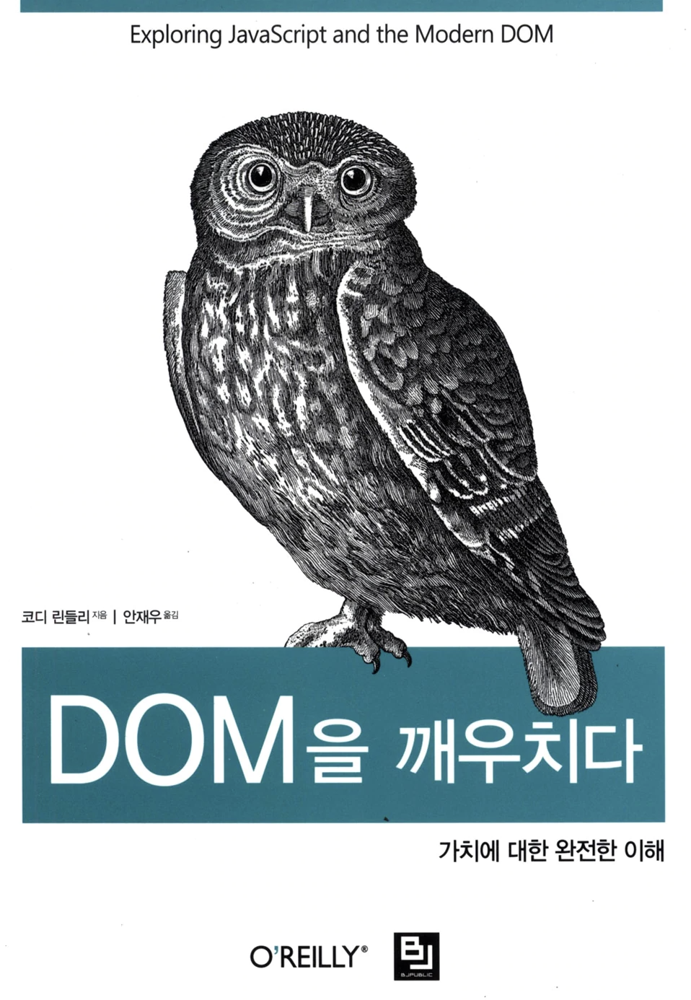

DOM을 깨우치다를 읽고 정리한 내용.

## DOM ❓

문서 개체 모델(Document Object Model)인 DOM은 자바스크립트 **노드** 개체의 계층화된 트리라고 한다.

여기서 노드의 유형은 다음과 같다.

- DOCUMENT_NODE (ex: window.document)
- ELEMENT_NODE (ex: \<body>, \<a>, \<p>, \<script>, ...)
- ATTRIBUTE_NODE (ex: class="line")
- TEXT_NODE (ex: HTML 내의 텍스트 문자)

그리고 노드를 다루기 위한 속성 및 메서드가 있다.

Node 속성

- childNodes
- **firstChild**
- **lastChild**
- **nextSibling**
- nodeName
- nodeType
- nodeValue
- parentNode
- **previousSibling**

Node 메서드

- **appendChild()**
- cloneNode()
- compareDocumentPosition()
- contains()
- hashChildNodes()
- insertBefore()
- isEqualNode()
- **removeChild()**
- replaceChild()

Document 메서드

- **document.createElement()**
- document.createTextNode()

HTML Element 속성

- **innerHTML**
- outerHTML
- textContent
- innerText
- outerText
- firstElementChild
- lastElementChild
- nextElementChild
- previousElementChild
- children

HTML element 메서드

- insertAdjacentHTML()

## Document Node

document 노드의 속성과 메서드는 다음과 같다.

- doctype
- documentElement
- implementation
- activeElement
- body
- head
- **title**
- **lastModified**
- **referrer**
- **URL**
- defaultview
- compatMode
- ownerDocument
- hasFocus()

## Element Node

Element 개체의 속성 및 메서드는 다음과 같다.

- createElement()
- tagName
- children
- **getAttribute()**
- **setAttribute()**
- hasAttribute()
- removeAttribute()
- **classList()**
- **dataset**
- **attributes**

### attributes

element의 attribute 값을 가져오고 설정 및 제거하는 일관적인 방법은 **getAttribute**, **setAttribute**, **removeAttribute**를 이용하는 것이다.

```html
<!DOCTYPE html>
<html lang="en">
  <body>
    <input
      type="text"
      id="idInput"
      name="nameInput"
      class="inputBox blue"
      value="basic"
      data-index="1"
    />

    <script>
      // Many ways call input
      const input = document.querySelector('input[name="nameInput"]');
      // const input = document.querySelector('input[type="text"]');
      // const input = document.querySelector('#idInput');
      // const input = document.querySelector('.inputBox');

      input.removeAttribute('id');
      input.removeAttribute('name');
      input.removeAttribute('class');
      input.removeAttribute('value');
      input.removeAttribute('data-index');

      input.setAttribute('id', 'idInput');
      input.setAttribute('name', 'nameInput');
      input.setAttribute('class', 'inputBox');
      input.setAttribute('value', 'basic');
      input.setAttribute('data-index', '1');

      console.log(input.getAttribute('id'));
      console.log(input.getAttribute('name'));
      console.log(input.getAttribute('class'));
      console.log(input.getAttribute('value'));
      console.log(input.getAttribute('data-index'));
    </script>
  </body>
</html>
```

### classList

또한 element의 **classList**를 사용하면 class Attribute 값을 얻을 수 있다.

```html
<!DOCTYPE html>
<html lang="en">
  <body>
    <span class="span blue solid"></span>

    <script>
      const span = document.querySelector('.span');

      console.log(span.classList);
      /*
        DOMTokenList(3) ["span", "blue", "solid", value: "span blue solid"]
        0: "span"
        1: "blue"
        2: "solid"
        length: 3
        value: "span blue solid"
      */
      console.log(span.className);
      // span blue solid

      span.classList.add('red');
      span.classList.remove('blue');
      console.log(span.className);
      // span solid red

      span.classList.toggle('red');
      console.log(span.className);
      // span solid

      span.classList.toggle('red');
      console.log(span.className);
      // span solid red
    </script>
  </body>
</html>
```

class를 수정하기 위해서는 classList와 setAttribute를 이용하는 방법이 있다.
둘 중 어떤 것을 사용하는 것이 좋을까? setAttribute는 값 전체를 초기화하고 설정값으로 고친다.

```js
const span = document.querySelector('.span');
console.log(span.className);
// span blue solid

span.setAttribute('class', 'red');
console.log(span.className);
// red (기존 값이 전부 리셋된다)
```

하지만 classList를 이용하면 기존 값을 건드리지 않고 대상 값만 변경할 수 있다.

```js
const span = document.querySelector('.span');
console.log(span.className);
// span blue solid

span.classList.add('red');
span.classList.remove('blue');
console.log(span.className);
// span solid red

span.classList.toggle('red');
console.log(span.className);
// span solid
```

### data-\* attribute

element의 dataset 속성을 이용하면 data-\*로 시작하는 모든 attribute 개체 정보를 알아낼 수 있다.

```html
<!DOCTYPE html>
<html lang="en">
  <body>
    <span
      class="span"
      data-hello="world"
      data-select-color="red blue green"
    ></span>

    <script>
      const span = document.querySelector('.span');

      console.log(span.dataset.hello); // world
      console.log(span.dataset.selectColor); // red blue green

      // Add dataset
      span.dataset.languageCode = 'python javascript c';
      console.log(span.dataset.languageCode); // python javascript c
    </script>
  </body>
</html>
```

> dataset을 호출할 때는 camelCase로 접근해야 한다.

## Document Node Select

### Node

element를 선택할 때 가장 흔히 사용되는 메서드는 다음과 같다.

- querySelector()
- getElementById()

```html
<!DOCTYPE html>
<html lang="en">
  <body>
    <ul>
      <li class="word">Hello</li>
      <li class="word" id="world">World</li>
      <li class="word">!!!</li>
    </ul>

    <script>
      console.log(document.querySelector('li')); // <li class="word">Hello</li>
      console.log(document.getElementById('world')); // <li class="word" id="world">World</li>
    </script>
  </body>
</html>
```

이 떄 **querySelector**는 조건에 맞는 첫번째 노드 element를 반환한다.

### NodeList

노드 리스트(NodeList)를 선택하는데 흔히 사용되는 메서드는 다음과 같다.

- querySelectorAll()
- getElementsByTagName()
- getElementsByClassName()

```html
<!DOCTYPE html>
<html lang="en">
  <body>
    <ul>
      <li class="word">Hello</li>
      <li class="word">World</li>
      <li class="word">!!!</li>
    </ul>

    <script>
      // Same Result
      console.log(document.querySelectorAll('li'));
      console.log(document.getElementsByTagName('li'));
      console.log(document.getElementsByClassName('word'));
      /*
        NodeList(3) [li.word, li.word, li.word]
        0: li.word
        1: li.word
        2: li.word
        length: 3
      */
    </script>
  </body>
</html>
```

### children

element에서 자식 노드를 확인하려면 children 속성을 이용하면 된다.

```html
<!DOCTYPE html>
<html lang="en">
  <body>
    <ul>
      <li>Hello</li>
      <li>World</li>
      <li>!!!</li>
    </ul>

    <script>
      console.log(document.querySelector('ul').children);
      /*
        HTMLCollection(3) [li, li, li]
        0: li
        1: li
        2: li
        length: 3
        __proto__: HTMLCollection
      */
    </script>
  </body>
</html>
```

## Dom Event

이벤트 작성 중

[참조](https://devbox.tistory.com/entry/JavaScript-Node-%EA%B0%9D%EC%B2%B4#recentEntries)

👋
