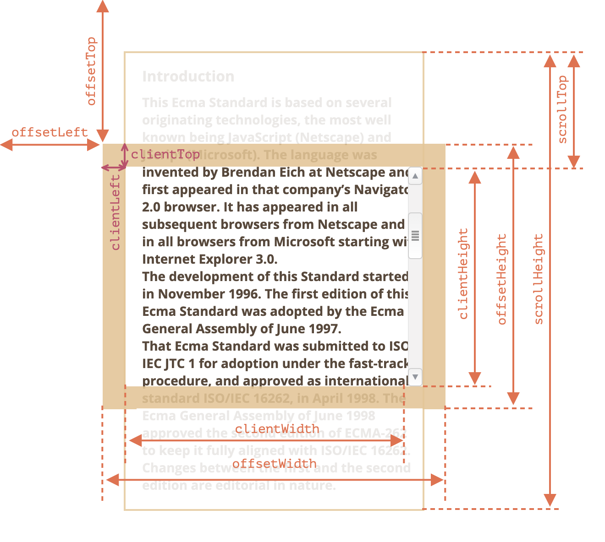
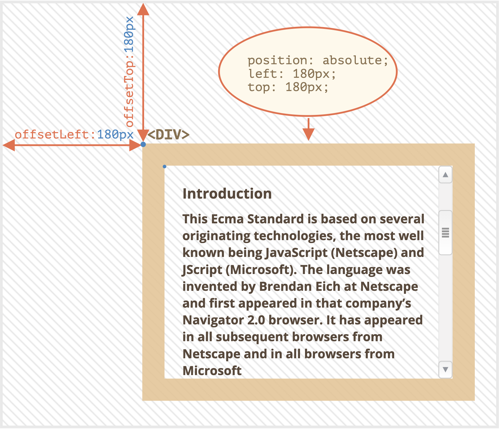
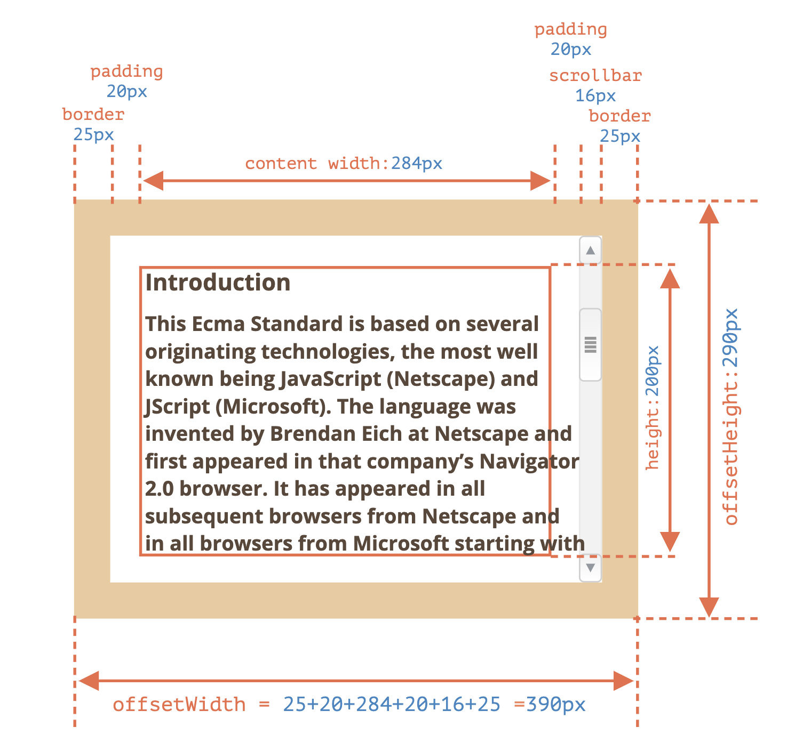

# Javascript30

> `정리` : [**Javascript30**](https://javascript30.com)을 공부한 내용 기록

# 24 - Sticky Nav

## 목표

### 요구사항

1. Sticky Nav를 구현한다.

### 필요기술

1. Javascript.
2. CSS.

## 배운 것

### Javascript

#### offset-



[HTMLElement](https://developer.mozilla.org/en-US/docs/Web/API/HTMLElement)의 offset항목(offsetTop, offsetLeft, offsetWidth, offsetHeight)를 알아보자.



**offsetTop**과 **offsetLeft**는 offsetParent를 기준으로 각각 요소가 아래로, 오른쪽으로 얼마나 떨어졌는지 알려준다.



**offsetWidth**와 **offsetHeight**는 대상의 전체 넓이와 높이를 알려준다.

더 자세한 정보는 [모던 JavaScript 튜토리얼 - 요소 사이즈와 스크롤](https://ko.javascript.info/size-and-scroll)에서 확인할 수 있다.

```js
const nav = document.querySelector('#main');
let topOfNav = nav.offsetTop;

const fixNav = () => {
  if (window.scrollY >= topOfNav) {
    document.body.style.paddingTop = nav.offsetHeight + 'px';
    document.body.classList.add('fixed-nav');
    return;
  }

  document.body.classList.remove('fixed-nav');
  document.body.style.paddingTop = 0;
  return;
};

window.addEventListener('scroll', fixNav);
```

### CSS

#### position

CSS [position](https://developer.mozilla.org/ko/docs/Web/CSS/position)은 뷰포트(viewport)에 상대적으로 위치가 지정된다.

즉 페이지 스크롤링이 되어도 같은 곳에 위치한다.

위치 설정은 top, right, bottom, left를 사용한다.

```css
/* ... */
nav {
  background: black;
  top: 0;
  width: 100%;
  transition: all 0.5s;
  position: relative;
  z-index: 1;
}
body.fixed-nav nav {
  position: fixed;
  box-shadow: 0 5px 0 rgba(0, 0, 0, 0.1);
}
/* ... */
```

#### transform

CSS [transform](https://developer.mozilla.org/ko/docs/Web/CSS/transform)은 요소에 회전, 크기 조절, 기울이기, 이동 효과를 부여할 수 있다.

여기서 **scale**은 요소의 크기를 확대 또는 축소 시킨다.

또한 CSS [transition](https://developer.mozilla.org/ko/docs/Web/CSS/CSS_Transitions/Using_CSS_transitions)은 CSS 속성을 변경할 때 애니메이션 효과를 제공한다.

```css
/* ... */
.site-wrap {
  max-width: 700px;
  margin: 70px auto;
  background: white;
  padding: 40px;
  text-align: justify;
  box-shadow: 0 0 10px 5px rgba(0, 0, 0, 0.05);
  transform: scale(0.98);
  transition: transform 0.5s;
}
/* page more bigger */
body.fixed-nav .site-wrap {
  transform: scale(1);
}
/* ... */
```

👋
