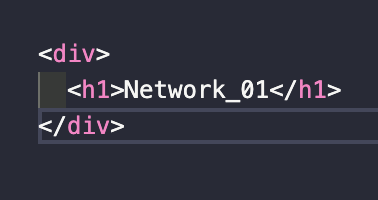

> `서적` '하루 3분 네트워크 교실'을 읽고 이해한 내용 정리

# Network Study - 01 😃

## 01. 네트워크란?

- 무언가(PC)와 무언가(컴퓨터)가 그물망처럼 무언가(통신매체)에 의해 연결된 것.
- 점(node)과 점이 선(link)으로 연결되어 그물망처럼 됨.
- 이 때 네트워크는 연결에 의해 무언가(데이터)를 주고 받는다.

## 02. 네트워크의 장점.

- 컴퓨터와 컴퓨터가 그물망처럼 통신 매체로 연결되어 데이터를 운반하는 것.
  1대의 컴퓨터 => 리소스
- 네트워크의 장점은 복수의 컴퓨터를 연결하여 리소스를 공유할 수 있음.
- 리소스: 컴퓨터나 사용자가 가진 물리적, 논리적을 따지지 않는 자원.
  (컴퓨터: 프린트, 파일정보, CPU 처리량, 메로리 처리량 / 사용자: 가진 지식과 지능)
- 즉, 리소스를 유용하게 활용하기 위해 공유하는 것이 바로 네트워크의 장점.

## 03. 데이터 통신 기초.

- 데이터: 무언가에 대한 정보를 컴퓨터 상에서 표현한 것.
  (이 떄 정보는 비트(bit)로 구성된다.)
- 네트워크를 주고 받는 데이터 통신을 위해서는 프로토콜이 필요.
- 프로토콜은 데이터 통신상의 규칙이다.

## 04. 회선 교환과 패킷 교환.

- 데이터 통신은 회선 교환과 패킷 교환이 있다.
- 회선은 파이프를 교체하는 방식이다.
- 패킷 교환은 패킷으로 분할해서 송신하는 방식.
- 컴퓨터 네트워크는 패킷 교환 방식.

## 05. 네트워크의 구조.

- 패킷 교환 네트워크는 PC, 통신 매체, 인터페이스, 라우터로 이루어짐.
- 네트워크에는 멀티엑세스 네트워크(허브)와 포인트 투 포인트(1:1) 두 종류가 있다.
