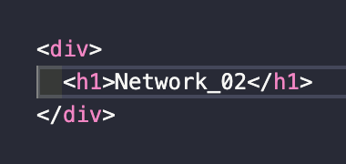

> `서적` : **'하루 3분 네트워크 교실'**을 읽고 이해한 내용 정리

# Network Study - 02. 😃

## 06. LAN과 WAN

- **LAN**(Local Area Network) : 구내에 설치된 네트워크
- **WAN**(Wide Area Network) : 떨어져 있는 지역의 LAN끼리 **통신사업자**의 통신케이블을 빌려서 연결한 네트워크
  > 세계 최대규모의 WAN은 `인터넷`이다.

## 07. OSI 참조 모델

- OSI 참조 모델 : 데이터 통신의 단계 구성도
- 데이터 통신은 7단계(계층/Layer)로 나누어진다.
- 하위계층은 상위계층을 위해 일하고 상위계층은 하위계층에 관여하지 않는다.

### OSI 계층 구분

|  단계   |      계층      |                  설명                   |    구분    |
| :-----: | :------------: | :-------------------------------------: | :--------: |
| `7계층` |    응용계층    | 사용자에게 네트워크 서비스를 제공한다.  | `내용표현` |
| `6계층` |    표현계층    |        데이터의 형식을 결정한다.        | `내용표현` |
| `5계층` |    세션계층    |   데이터 송수신의 순서 등을 관리한다.   | `내용표현` |
| `4계층` |    전송계층    |     신뢰성이 높은 전송을 시행한다.      |  `전송물`  |
| `3계층` |  네트워크계층  |     전송 규칙과 수신처를 결정한다.      |  `전송물`  |
| `2계층` | 데이터링크계층 | 인접기기 사이의 데이터 전송을 제어한다. |   `전송`   |
| `1계층` |    물리계층    | 전기, 기계적인 부분의 전송을 시행한다.  |   `전송`   |

## 08. 캡슐화

- 계층의 순서대로 헤더가 부가된느 것을 캡슐화라고 한다.
- 통신시 데이터를 송신할 때는 제어용 정보**(프로토콜 데이터 유닛(PDU) or 패킷)**가 필요하다.
- 수신한 쪽은 반대의 순서로 헤더를 확인하여 데이터를 입수한다.

### PDU의 호칭

|   계층   |          호칭          |                     내용                      |
| :------: | :--------------------: | :-------------------------------------------: |
| `사용자` |     `데이터(Data)`     |            송수신하고 싶은 데이터             |
| `7계층`  |   `메시지(Message)`    |  데이터를 통신용으로 변환한 것과 7계층 헤더   |
| `6계층`  |   `메시지(Message)`    |  데이터를 통신용으로 변환한 것과 7계층 헤더   |
| `5계층`  |   `메시지(Message)`    |  데이터를 통신용으로 변환한 것과 7계층 헤더   |
| `4계층`  |  `세그먼트(Segement)`  |              메시지와 4계층 헤더              |
| `4계층`  | `데이터그램(Datagram)` |              메시지와 4계층 헤더              |
| `3계층`  | `데이터그램(Datagram)` |       세그먼트, 데이터그램과 3계층 헤더       |
| `2계층`  |    `프레임(Frame)`     |            데이터그램과 2계층 헤더            |
| `1계층`  |         `신호`         | 프레임을 전송매체로 운반하기 위한 신호로 변환 |

## 09. 프로토콜

- 데이터 통신을 위한 규칙
- 프로토콜은 **'데이터의 내용을 결정'**하고 **'헤더를 결정'**한 뒤에 **'송수신 순서'**를 결정한다.
- 사실상 TCP/IP 프로토콜을 사용한다.

## 10. TCP/IP 모델

|  단계   |        계층        |             내용              |
| :-----: | :----------------: | :---------------------------: |
| `4계층` | `어플리케이션계층` |      HTTP, FTP, SMTP 등       |
| `3계층` |  `트랜스포트계층`  |           TCP, UDP            |
| `2계층` |    `인터넷계층`    |            IP, ARP            |
| `1계층` |  `인터페이스계층`  | 이더넷, 프레임 릴레이, PPP 등 |

👋
