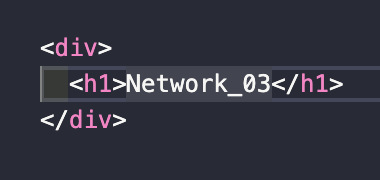

> `서적` : **'하루 3분 네트워크 교실'**을 읽고 이해한 내용 정리

# Network Study - 03. 😃

## 11. 1계층의 역할과 개요.

- 1계층의 역할 : 케이블이 연결되어 있는 기기에 신호를 전달한다.
- 통신매체 : 신호가 지나가는 '파이프' 역할을 한다. / 케이블은 무선과 유선으로 나뉜다.
- 유선케이블 : 전기 신호를 사용하는 **동선**(UTP) / 광신호를 사용하는 **광파이버** 가 있다.

## 12. 신호와 충돌.

- 신호는 비트를 ~신호로 바꾸어(인터페이스)~ 케이블에 보낸다.
- 1초동안 전해지는 비트의 수를 `bps`**(bit per second)**라고 한다.
  > 킬로(k = $10^3$), 메가(m = $10^6$), 기가(g = $10^9$)
- 신호의 형태나 전송방법에 의해서 통신속도가 정해진다.
- 신호는 감쇠, 노이즈, 간섭, 총돌 등이 문제가 발생한다.

## 13. 허브

- 허브는 신호의 증폭과 재생을 수행하고 다수의 컴퓨터를 연결함.
- 허브는 수신한 포트 이외에 모든 포트에 수신한 신호를 송신**(플러딩)**한다.
- 허브에 연결한 여러기기가 신호를 보내면 충돌할 가능성이 있다.
  > 그래서 충돌 도메인(컴퓨터)가 작아야 충돌에 유리하다.

## 14. 2계층의 역할과 개요

- 신호의 송신 전이나 수신 후에 바르게 데이터를 송수신하는 순서가 필요함.
  > 2계층은 데이터 전송(`세그먼트 범위`)에 관한 규정을 이야기 함.
- 규칙은 LAN 용도와 WAN용도로 나누어진다.
- LAN은 이더넷(`Ethernet`)이 사실표준이다.
  > 이더넷에서 사용되는 것은 프레이밍(**프레임 포맷을 비트열에 적용시킴**) 기법이다.

👋
