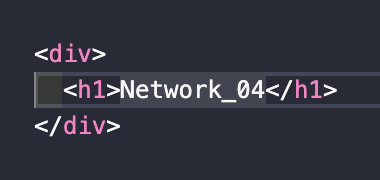

> `서적` : **'하루 3분 네트워크 교실'**을 읽고 이해한 내용 정리

# Network Study - 04. 😃

## 15. 2계층 주소와 이더넷

- 주소(Address) : 데이터를 보내는 **상대와 자신을 특정**하는 데이터.
- 어드레싱(Addressing) : 주소를 어떻게 배정할지 결정하는 것.
- 데이터 전송 방법은 3종류로 나누어진다.
  - 유니캐스트 : **1**대**1** · 특정한 1대만 수신처인 데이터 통신.
  - 브로드캐스트 : **1**대**전체** · 전원, 즉 모두에게 메시지를 보내는 데이터 통신.
  - 멀티캐스트 : **1**대**다수** · 지정된 복수의 기기로 메시지를 보내는 데이터 통신.
- MAC 주소 : 이더넷에서 사용되는 주소로 **인터페이스에 지정된 고정 주소**.
- 각각의 기기는 유니캐스트 주소를 적어도 한 개씩 가지고 있다.

  > 라우터처럼 복수의 인터페이스를 가진 기기는 인터페이스마다 유니캐스트 주소를 가진다.
  > 여기서 유니캐스트 주소들은 모두 유일해야 한다.

## 16. 이더넷

- 프레임 : 이더넷에서는 *수신처*와 *송신처*의 **MAC 주소, 에러 체크 등**을 **헤더와 트레일러**로 붙인다.
- 이더넷 동작 : 데이터 송신 시 수신한 프레임 수신처 MAC 주소를 보고 자기에게 온 것 외에 다른 프레임을 파기한다.
- 이더넷은 신호를 보내는 타이밍을 겹치지 않게 하여 되도록 충돌이 일어나지 않도록 하는데, 이를 위해 CSMA/CD를 사용한다.

## 17. 스위치

- 케이블에서는 송신과 수신이 충돌하지 않지만, 허브에서는 충돌이 발생한다.
- 스위치는 수신한 프레임을 따로 보낼 수 있도록 처리하여 충돌을 막는다.
  > 💡 MAC 주소를 **필터링과 버퍼링**하여 충돌을 방지한다.
  >
  > MAC 주소를 필터링하는 방법(**동작**).  
  > ㄴ 학습 : 수신한 프레임의 송신처 MAC 주소를 기록하여 컴퓨터 MAC 주소를 기억한다(`어드레스 테이블`).  
  > ㄴ 스위칭 : 수신한 포트와 MAC 주소를 연관 짓는다.
- 프레임을 수신한 스위치는 수신처 MAC 주소를 보고 그 MAC 주소가 있는 포트만 프레임을 송신한다.
- 그 결과 수신처가 다른 프레임이 동시에 스위치에 도달해도 충돌은 발생하지 않는다.

## 18. 전이중 이더넷

- 버퍼링 : 버퍼를 사용한 처리를 실행한다.
  > `버퍼` : 일시적으로 데이터를 기록해둘 수 있는 기억기기(메모리).
- 스위치에서 데이터 수신 시 충돌할 것 같은 프레임을 버퍼에 일시적으로 저장해둔다.
- 버퍼가 가득 찬다면 **백 프레셔** 또는 **IEEE802.3x**라는 규격을 이용해 송신을 조정한다.
- 즉, 충돌 도메인은 스위치에 의해 분할되어 충돌이 나지 않는다.

- 스위치를 사용함으로써 CSMA/CD를 사용할 필요가 없어진다.
- 전이중 이더넷(스위치) : 동시에 송신과 수신을 할 수 있는 방식.
- 반이중 통신(CSMA/CD) : 누군가 송신 중일 때는 송신이 불가능, 자기가 송신 중일 때도 수신이 불가능

👋
