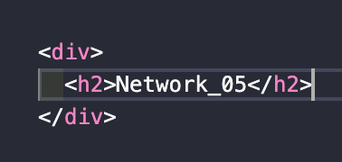

> `서적` : **'하루 3분 네트워크 교실'**을 읽고 이해한 내용 정리

# Network Study - 05. 😃

## 19. 3계층의 역할과 개요

복습 📚

- 1계층 : 케이블이 연결된 상대에 대한 신호 전달.
- 2계층 : 신호 송수신 가능한 상태에서 **세그먼트 내에서 데이터를 어떻게 주고받음.**

세그먼트❓ : 라우터와 라우터 간의 범위.

- **3계층** : 세그먼트 간에서 데이터 송수신을 하는 것.
- _네트워크_ : 좁은 의미의 네트워크는 라우터와 라우터로 분배된 컴퓨터 그룹.

- _네트워크(좁은 의미)_ 내에 컴퓨터는 2계층에 의해 연결되어 있다.
- 이때 라우터를 넘어서는 브로드캐스트는 송신되지 않는다.
- 그래서 _네트워크_ 간에서 데이터 송수신을 위해 **인터넷 작업(Internetwork)**을 한다.

정리 📚: 3계층은 인터넷 작업을 수행하여 떨어진 위치에 있는 컴퓨터끼리 통신이 가능하다.

## 20. 인터넷 프로토콜

- 3계층의 인터넷 작업을 실현하기 위해 필요한 것은 **어드레싱**과 **라우팅**이다.
- 어드레싱 : 2계층 이더넷 - MAC 주소(물리 주소) · 3계층 - IP 주소(논리 주소).
- 라우팅 : 수신처까지 어떤 경로로 갈지를 결정.
- 이 두 가지 **어드레싱**과 **라우팅**으로 인터넷 작업을 수행하기 위해 사용되는 것이 **IP(Internet Protocol)**이다.

- 인터넷 프로토콜(IP) : TCP/IP에서는 반드시 IP를 사용한다(IPv4, IPv6).

## 21. IP 주소 1

IP 주소 : **논리 주소**로서 **계층형 특징**을 가지며 네트워크 관리자가 컴퓨터에 할당한다.

- 논리 주소 : 네트워크에 접속할 때마다 붙이는 주소(고정 주소가 아님).
- 논리 주소에도 유니캐스트·멀티캐스트·브로드캐스트 3종류의 주소가 있다.
- 네트워크 번호는 접속된 모든 네트워크에서 유일해야 하고, 컴퓨터 번호는 그 네트워크 내에서 유일해야 한다.

- *IPv4*는 *32비트*를 가지며 *IPv6*는 *128비트*이다.
- 8비트마다 10진수로 표기하고 8비트 사이에 **점**을 찍는다.
- 이 8비트의 단락을 **옥텟(Octet)**이라고 한다.
- 이 4개의 옥텟, 32비트가 *네트워크 번호*의 **컴퓨터 번호**를 나타낸다.

## 22. IP 주소 2

클래스 : 할당된 조직의 규모에 따라 대출 IP 범위(네트워크 번호, 컴퓨터 번호)를 정하는 것.

- 클래스는 A~E까지 5개로 나누어진다. 이에 따라 네트워크 번호를 표시하는 부분의 비트 수가 정해져 있다.
- 클래스로 나누어 IP 주소를 할당하는 방식을 **클래스풀 어드레싱**이라고 한다.

- 네트워크 번호 할당 후, 컴퓨터 번호를 설정하는 것을 **호스트 번호**라고 부르는데 네트워크의 관리자가 임의로 정한다.
- 호스트 번호 중에는 특별한 의미를 가져서 실제 컴퓨터에 할당해서는 안 되는 주소가 있다.
- *호스트 번호의 비트가 모두 0이 되는 주소*와 *호스트 번호의 비트가 모두 1인 주소*이다.

  💡예) 클래스C에서 네트워크 번호가 **192.168.12**인 경우 **192.168.12.0(_네트워크 주소_)**과 **192.168.12.255(_브로드캐스트 주소_)**이다.

## 23. 서브네팅

- 효율적인 관리를 위해 네트워크를 _작은 네트워크_(서브넷 or 서브네트워크)으로 나눈다.
- 호스트 번호의 **비트**를 *서브넷 번호*와 *호스트 번호*로 분할한다.

- **서브네팅** : 네트워크에서 **서브넷화**하는 것.
- 서브넷의 숫자를 크게 하면 각 서브넷의 호스트 수는 감소하게 된다.
- 서브네트워크를 사용할 경우 IP 주소는 네트워크 번호, 서브넷 번호, 호스트 번호가 된다.

- **서브넷마스크** : 비트열을 IP 주소와 동시에 표기하여 **어디까지가 서브넷 번호인지를 구분**한다.
- 네트워크 번호, 서브넷 번호의 비트수를 나타내기 위해 서브넷마스크를 사용한다.

👋
