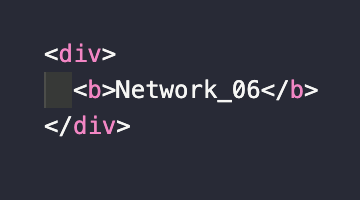

> `서적` : **'하루 3분 네트워크 교실'**을 읽고 이해한 내용 정리

# Network Study - 06. 😃

## 24. 클래스리스 어드레싱

**클래스리스 어드레싱** : 클래스라는 구분을 없앤 어드레싱.

- 클래스풀 어드레싱은 낭비가 많다.  
  💡**예시)** 900개의 IP주소가 필요한 경우 클래스C(256)는 적고 클래스B(65,000)는 많다.
- 그래서 이런 경우는 클래스리스 어드레싱을 사용한다.
- 슈퍼넷(Super Network) : 여러 개의 클래스를 통합해서 1개의 네트워크로 운용한다.
- *클래스리스*에서는 **프리픽스 길이로 네트워크 번호의 비트 수**를 나타낸다.

## 25. DHCP

*IP 주소*에 관한 _클래스풀 어드레싱_, _서브넷마스크_, *클래스리스 어드레싱*이 존재하는 목적은 수선처와 송신처를 지정하기 위함이다.  
이 때 이더넷을 사용하여 IP 데이터그램을 송수신하기 위해서는 **4개의 주소**가 필요하다.

- 수신처 MAC 주소
- 송신처 MAC 주소 : 송신할 인터페이스에 고정 MAC 주소를 사용한다.
- 수신처 IP 주소
- **송신처 IP 주소 : 송신할 인터페이스에 설정된 IP 주소(정적, 동적)를 사용한다.**

송신처 IP 주소 설정 방식은 수동으로 정하는 정적인 방식과 DHCP를 사용해서 자동으로 할당하는 동적인 방식이 있다.  
그리고 자동으로 컴퓨터에 설정되도록 하는 프로토콜을 **DHCP**라고 한다.

💡**DHCP(Dynamic Host Configuration Protocol)** 📚

- DHCP는 할당할 IP 주소를 관리하고 실제로 할당 작업을 수행하는 **서버(Server)**와 할당받는 **클라이언트(Client)**로 이루어진다.
- 이를 각각 **DHCP 서버**와 **DHCP 클라이언트**라고 부른다.
- 각 클라이언트는 DHCP 서버가 가지고 있는 어드레스 풀(IP 주소 풀)로부터 IP 주소를 할당받는다.

IP 주소 풀 ❓ : 사전에 관리자가 할당할 주소의 범위.

## 26. ARP

수신처 MAC 주소는 수신처의 IP 주소가 결정된 후에 정해진다.
IP 주소를 알았다면 수신처 MAC 주소를 알기 위해서는 **ARP**를 사용한다.

💡**ARP(Address Resolution Protocol)** 📚

- ARP는 수신처 IP 주소에 대응하는 MAC 주소를 조사하기 위한 질문을 하는 프로토콜이다.
- ARP 요청은 브로드캐스트로 네트워크 내의 모든 컴퓨터에 송신된다.

💡**ARP 테이블**

- ARP 테이블은 **IP 주소와 MAC 주소의 대응표**를 말한다.
- APR 요청을 송신한 측의 컴퓨터는 응답한 ARP의 결과를 APR 테이블에 기재한다.
- ARP 테이블은 일정 기간 지나면 파기된다.

## 27. DNS

수신처 IP 주소를 알아내기 위해 **DNS**를 이용한다.

💡**DNS(Domain Name System)** 📚

- **DNS**는 **이름과 IP 주소를 대응시킨 시스템**이다.
- 이름과 IP 주소의 **대응 데이터베이스**를 가진 **DNS 서버**에 **문의**하여 **수신처의 IP 주소를 입수**한다.
- IP 주소를 알고 있으면, 그것을 사용할 수가 있다.
- 호스트 명을 알고 있는 경우는 DNS를 사용한다.

👋
